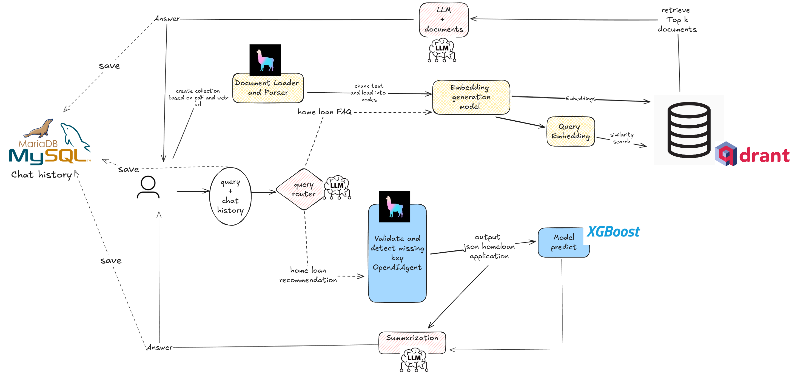

# SmartLoanAI: Intelligent Chat & Document Assistant for Home Loan Applications

A comprehensive AI-powered solution that leverages Large Language Models (LLMs) to create an intelligent chatbot for home loan applications. The system provides two main services:

- **Home Loan FAQ**: Answers user questions about market trends, eligibility criteria, interest rates, and refinancing options
- **Home Loan Recommendation**: Processes home loan applications, summarizes key information, identifies missing data, and provides approval recommendations

This AI-powered chatbot stack is designed for scalable deployment on **Google Kubernetes Engine (GKE)**.

### Core Components

* **Backend API**: FastAPI with Uvicorn for serving LLM-based responses and managing logic.
* **Celery Worker**: Handles asynchronous background tasks such as embedding generation and model inference.
* **Chatbot UI**: Streamlit-based interface for user interactions.
* **MariaDB**: SQL database storing user data, chat history, and metadata.
* **Valkey / Redis**: Acts as both task broker (for Celery) and high-performance caching layer.
* **Qdrant**: Vector database for semantic search and embedding retrieval.

### MLOps Tools

* **Terraform**: Infrastructure-as-code for provisioning GKE and related resources.
* **Jenkins + Ansible**: CI/CD pipeline for automated deployment and updates.
* **Prometheus + Grafana**: Monitoring performance metrics and system health.
* **ELK Stack (Elasticsearch, Logstash, Kibana)**: Centralized logging and troubleshooting.


## Table of Contents

- [Getting Started](#getting-started)
- [Application Services](#application-services)
  - [RAG (Retrieval-Augmented Generation) Home Loan FAQ](#rag-retrieval-augmented-generation-home-loan-faq)
  - [Personal Home Loan Recommendation](#personal-home-loan-recommendation)
- [Deployments on Google Cloud](#deployments-on-google-cloud)
- [CI/CD with Jenkins](#build-cicd-with-jenkins)
- [Monitoring](#monitoring-with-prometheus-and-grafana)
- [Logging](#logging-with-filebeat--logstash--elasticsearch--kibana)

## Getting Started

### Install [uv](https://github.com/astral-sh/uv) (Python package manager)

```bash
pip install uv
```

### Prepare Python Virtual Environment
Install all dependencies dedicated to the project locally:

```bash
uv venv
.venv\Scripts\activate  # On Windows
# or
source .venv/bin/activate  # On Linux/Mac
```

```bash
uv pip install -r backend/requirements.txt
uv pip install -r maria_db/requirements.txt
uv pip install -r chatbot-ui/requirements.txt
```

Start application on docker containers:
```bash
bash backend/run.sh 
bash chatbot-ui/run.sh
bash maria_db/run.sh
```

### Running Application Docker Containers Locally

- **FastAPI Backend**: Navigate to `http://localhost:8082/docs` for API documentation
- **Chatbot Interface**: Access the UI at `http://localhost:8051/`

## Application Services


### RAG (Retrieval-Augmented Generation) Home Loan FAQ

#### Introduction
This service addresses frequently asked questions (FAQs) related to home loans, covering:

- **Eligibility**: Requirements to qualify for a home loan
- **Market Trends**: Current market conditions and their impact
- **Refinancing**: Guidance on refinancing existing loans
- **Interest Rates**: Current rates and their effect on repayments

#### Knowledge Base Sources

| **Category** | **Sources** |
|--------------|-------------|
| **Interest Rate** | CNET Mortgage Rate Predictions, Yahoo Finance Data |
| **Market Trends** | LinkedIn Market Reviews, Bankrate Housing Trends, Freddie Mac Forecasts |
| **Eligibility** | HDFC & ICICI Bank Calculators, Banking Institution Guidelines |
| **Refinancing** | Athena Requirements, Investopedia Guides |

#### RAG Flow Process

1. **Intent Routing**: Analyzes user queries and chat history to determine intent and map to appropriate knowledge collections
2. **Embedding**: Converts user intent to vectors using `text-embedding-3-small` model
3. **Retrieval**: Matches embedded queries against Qdrant vector database
4. **Generation**: Combines retrieved documents with user context to generate comprehensive responses

#### Current Performance Metrics
- **Faithfulness Score**: 85%
- **Context Relevancy Score**: 85%

Evaluated on a golden dataset of 148 questions across different home loan topics.

### Personal Home Loan Recommendation

#### Introduction
This service predicts and assesses home loan applications, identifies missing information, and provides approval/rejection recommendations.

#### Methodology
The service uses OpenAI agents with specialized tools:

- **Information Collection**: Gathers mandatory application fields from user conversations
- **Missing Value Detection**: Validates completeness of applications
- **ML Prediction**: Uses XGBoost model trained on HMDA dataset for approval predictions
- **Recommendation Generation**: Provides detailed summaries and recommendations

#### Required Application Fields
```json
{
    "name": "String",
    "income": "Numeric",
    "loan_amount": "Numeric", 
    "property_value": "Numeric",
    "loan_term": "Numeric",
    "loan_purpose": "Home purchase|Refinance|Cash-out refinancing|Home improvement|Other"
}
```

#### Fine-Tuning Results
- **Base Model**: `gpt-4o-mini-2024-07-18`
- **Training Dataset**: 41 samples
- **Test Dataset**: 24 samples  
- **Accuracy**: 95% success rate across diverse scenarios
- **Output Format**: Consistent JSON structure for downstream processing

---

# Deployments on Google Cloud

### Additional Installation (Skip if you have already installed):
* [Docker](https://docs.docker.com/desktop/install/ubuntu/)
* [Kubectl](https://kubernetes.io/docs/tasks/tools/install-kubectl-linux/)
* [kubectx + kubens](https://github.com/ahmetb/kubectx#manual-installation-macos-and-linux) (Optional)
* [Terraform](https://developer.hashicorp.com/terraform/tutorials/aws-get-started/install-cli#install-terraform)

## GKE Cluster Setup

### Manual Approach

#### Create GKE Cluster

- Go to [GKE UI](https://console.cloud.google.com/kubernetes).
- Click **Create Cluster** and follow the instructions.
- You need to switch from autopilot to **STANDARD MODE**.
- You can leave most other settings as default for a simple setup.
- Click **Create** to provision your cluster.

---

### Automated Approach with Terraform

We can easily connect to GKE using the Gcloud CLI. Reading this guide to install [gcloud CLI](https://cloud.google.com/sdk/docs/install#deb) in local terminal gcloud CLI.

After that, initialize the gcloud CLI by typing `gcloud init`, then type "Y". Then you need to install the gke-gcloud-auth-plugin binary: `gcloud components install gke-gcloud-auth-plugin`

You can automate GKE cluster creation using **Terraform**.
- Initialize Terraform:
```bash
cd ./iac/terraform
terraform init
```

- Authenticate with GCP:
```bash
gcloud auth application-default login
```

- Preview the execution plan:
```bash
terraform plan
```

- Apply the plan:
```bash
terraform apply
```

---

## Connect to the GKE Cluster
- In the GKE UI, select your cluster and click **CONNECT**.
- Copy the `gcloud container ...` command and run it in your terminal:
  ```bash
  gcloud container clusters get-credentials <your_gke_name> --zone <zone> --project <project_id>
  ```
- You should see a message like:  
  `kubeconfig entry generated for <your_gke_name>`

- (Optional) Switch context using [kubectx](https://github.com/ahmetb/kubectx):
  ```bash
  kubectx <YOUR_GKE_CLUSTER>
  ```

<!-- ### Install NGINX Ingress Controller

```bash
helm upgrade --install ingress-nginx ingress-nginx \
  --repo https://kubernetes.github.io/ingress-nginx \
  --namespace ingress-nginx --create-namespace
``` -->
## Manual Deployment to GKE
### Deploy Nginx Ingress Controller:
The Nginx Ingress Controller manages external access to services in your Kubernetes cluster. Create a namespace and install the Ingress Controller using Helm:
```
kubectl create ns nginx-system
kubens nginx-system
helm upgrade --install nginx-ingress ./deployments/nginx-ingress
```
Please store the Nginx Ingress Controller's IP address, as you'll need it later.

### Deploy SmartLoanAI Model
Please refer to the [deployments/README.md](./deployments/README.md) for detailed deployment instructions.


---
# Build CI/CD with Jenkins
## Jenkins Server Setup on Google Cloud VM

### Manual Approach

#### 1. Create a VM Instance on Google Cloud

- Go to [Google Cloud Console](https://console.cloud.google.com/).
- Navigate to **Compute Engine > VM instances**.
- Click **Create Instance**.
- Choose a name, region, machine type (e.g., e2-medium), and boot disk (Ubuntu recommended).
- Allow HTTP and HTTPS traffic.
- Click **Create**.

#### 2. SSH into the VM

Generate your SSH key first. Open your local terminal, type
```
ssh-keygen -t rsa -b 4096 -C "your_email@example.com"
```

To see and copy the content of the file `~/.ssh/id_rsa.pub`, use the cat command:
```
cat ~/.ssh/id_rsa.pub
```

Navigate to [METADATA](https://console.cloud.google.com/compute/metadata) and Select the tab SSH KEYS and add SSH Key (the content of your file `~/.ssh/id_rsa.pub`):

Note: If the Metadata tab contains the key `enable-oslogin=true`, then change it to `enable-oslogin=false`.


#### 3. Install Docker

```bash
sudo -i
apt update -y
apt install docker.io -y
systemctl start docker
systemctl enable docker
```

#### 4. Run Jenkins with Docker

```bash
docker run -d \
  --name jenkins \
  -p 8081:8080 \
  -p 50000:50000 \
  -v jenkins_home:/var/jenkins_home \
  jenkins/jenkins:lts
```

#### 5. Configure Firewall Rules

- Go to **VPC Network > Firewall** in Google Cloud Console.
- Click **Create Firewall Rule**.
- Name: `jenkins-allow`
- Targets: All instances in the network
- Source IP ranges: `0.0.0.0/0`
- Protocols and ports: Select **Specified protocols and ports**, then check `tcp:8081`
- Click **Create**.
---

### Automated Approach with Ansible

You can automate the Jenkins VM creation using **Ansible**.

#### Prerequisites

- Create a [GCP service account](https://cloud.google.com/iam/docs/service-accounts-create) with `Compute Admin` permission.
- In the service account's Actions column, select **Manage keys**.
- Click **ADD KEY** → **Create new key** → **Create** and download the JSON file.
- Place the credentials JSON file under `/iac/ansible/secrets`.

Next create a Google Compute Engine instance named "jenkins-server" running Ubuntu 22.04 with a firewall rule allowing traffic on ports 8081 and 50000:
```bash
ansible-playbook iac/ansible/deploy_jenkins/create_compute_instance.yaml
```
> **Note:** Edit `create_compute_instance.yaml` to set your project id and service account (e.g., line 11 & 14, 43 & 45).

Deploy Jenkins on a server by installing prerequisites, pulling a Docker image, and creating a privileged container with access to the Docker socket and exposed ports 8081 and 50000:
```bash
ansible-playbook -i iac/ansible/inventory iac/ansible/deploy_jenkins/deploy_jenkins.yaml
```

## Access Jenkins
- Open web browser Jenkins UI through  
  `http://<YOUR_VM_EXTERNAL_IP>:8081`
- To get the initial admin password, run:
  ```bash
  docker exec jenkins cat /var/jenkins_home/secrets/initialAdminPassword
  ```
- Copy the password and paste it into the Jenkins setup page.

After entering the password, install the "set suggested plugin". 

### Install necessary plugins:
Navigate to Dashboard > Manage Jenkins > Plugins > Available plugin. And TYPE "Docker, Docker pipeline, gcloud SDK, kubernetes" on search bar. Then SELECT "Install without restart".

After installing the plugins, restart Jenkins.

```bash
sudo docker restart jenkins-server
```

### Configure Jenkins:

#### Add webhooks to your GitHub repository to trigger Jenkins builds.

Go to the GitHub repository and click on `Settings`. Click on `Webhooks` and then click on `Add Webhook`. Enter the URL of your Jenkins server (e.g. `http://<EXTERNAL_IP>:8081/github-webhook/`). Then click on `Let me select individual events` and select `Let me select individual events`. Select `Push` and `Pull Request` and click on `Add Webhook`.

#### Add Github repository as a Jenkins source code repository.

Go to Jenkins dashboard and click on `New Item`. Enter a name for your project (e.g. `easy-llmops`) and select `Multibranch Pipeline`. Click on `OK`. Click on `Configure` and then click on `Add Source`. Select `GitHub` and click on `Add`. Enter the URL of your GitHub repository. In the `Credentials` field, select `Add` and select `Username with password`. Enter your GitHub username and password (or use a personal access token). Click on `Test Connection` and then click on `Save`.

#### Setup docker hub credentials.

First, create a Docker Hub account. Go to the Docker Hub website and click on `Sign Up`. Enter your username and password. Click on `Sign Up`. Click on `Create Repository`. Enter a name for your repository and click on `Create`.

From Jenkins dashboard, go to `Manage Jenkins` > `Credentials`. Click on `Add Credentials`. Select `Username with password` and click on `Add`. Enter your Docker Hub username, access token, and set `ID` to `dockerhub`.

#### Setup Kubernetes credentials.

First, create a Service Account for the Jenkins server to access the GKE cluster. Go to the GCP console and navigate to IAM & Admin > Service Accounts. Create a new service account with the `Kubernetes Engine Admin` role. Give the service account a name and description. Click on the service account and then click on the `Keys` tab. Click on `Add Key` and select `JSON` as the key type. Click on `Create` and download the JSON file.

Then, from Jenkins dashboard, go to `Manage Jenkins` > `Cloud`. Click on `New cloud`. Select `Kubernetes`. Enter the name of your cluster, enter the URL and Certificate from your GKE cluster. In the `Kubernetes Namespace`, enter the namespace of your cluster (e.g. `model-serving`). In the `Credentials` field, select `Add` and select `Google Service Account from private`. Enter your project-id and the path to the JSON file.

#### Test the setup:

Push a new commit to your GitHub repository. You should see a new build in Jenkins.

---
# Monitoring with Prometheus and Grafana

### Create Discord webhook:

First, create a Discord webhook. Go to the Discord website and click on `Server Settings`. Click on `Integrations`. Click on `Create Webhook`. Enter a name for your webhook and click on `Create`. Copy the webhook URL.

### Configure Helm Repositories

First, we need to add the necessary Helm repositories for Prometheus and Grafana:

```bash
helm repo add prometheus-community https://prometheus-community.github.io/helm-charts
helm repo add grafana https://grafana.github.io/helm-charts
helm repo update
```

These commands add the official Prometheus and Grafana Helm repositories and update your local Helm chart information.

### Install Dependencies

Prometheus requires certain dependencies that can be managed with Helm. Navigate to the monitoring directory and build these dependencies:

```bash
helm dependency build ./deployments/monitoring/kube-prometheus-stack
```

### Deploy Prometheus

Now, we'll deploy Prometheus and its associated services using Helm:

```bash
kubectl create namespace monitoring
helm upgrade --install -f deployments/monitoring/kube-prometheus-stack.expanded.yaml kube-prometheus-stack deployments/monitoring/kube-prometheus-stack -n monitoring
```

This command does the following:
- `helm upgrade --install`: This will install Prometheus if it doesn't exist, or upgrade it if it does.
- `-f deployments/monitoring/kube-prometheus-stack.expanded.yaml`: This specifies a custom values file for configuration.
- `kube-prometheus-stack`: This is the release name for the Helm installation.
- `deployments/monitoring/kube-prometheus-stack`: This is the chart to use for installation.
- `-n monitoring`: This specifies the namespace to install into.

By default, the services are not exposed externally. To access them, you can use port-forwarding:

For Prometheus:
```bash
kubectl port-forward -n monitoring svc/kube-prometheus-stack-prometheus 9090:9090
```
Then access Prometheus at `http://localhost:9090`

For Grafana:
```bash
kubectl port-forward -n monitoring svc/kube-prometheus-stack-grafana 3000:80
```
Then access Grafana at `http://localhost:3000`

The default credentials for Grafana are usually:
- Username: admin
- Password: prom-operator (you should change this immediately)

**5. <a name="test-alerting"></a>Test Alerting**

First we need to create a sample alert. Navigate to the `monitoring` directory and run the following command:

```bash
kubectl port-forward -n monitoring svc/alertmanager-operated 9093:9093
```

Then, in a new terminal, run the following command:

```bash
curl -XPOST -H "Content-Type: application/json" -d '{
  "alerts": [
    {
      "labels": {
        "alertname": "DiskSpaceLow",
        "severity": "critical",
        "instance": "server02",
        "job": "node_exporter",
        "mountpoint": "/data"
      },
      "annotations": {
        "summary": "Disk space critically low",
        "description": "Server02 has only 5% free disk space on /data volume"
      },
      "startsAt": "2023-09-01T12:00:00Z",
      "generatorURL": "http://prometheus.example.com/graph?g0.expr=node_filesystem_free_bytes+%2F+node_filesystem_size_bytes+%2A+100+%3C+5"
    },
    {
      "labels": {
        "alertname": "HighMemoryUsage",
        "severity": "warning",
        "instance": "server03",
        "job": "node_exporter"
      },
      "annotations": {
        "summary": "High memory usage detected",
        "description": "Server03 is using over 90% of its available memory"
      },
      "startsAt": "2023-09-01T12:05:00Z",
      "generatorURL": "http://prometheus.example.com/graph?g0.expr=node_memory_MemAvailable_bytes+%2F+node_memory_MemTotal_bytes+%2A+100+%3C+10"
    }
  ]
}' http://localhost:9093/api/v2/alerts
```

This command creates a sample alert. You can verify that the alert was created by running the following command:

```bash
curl http://localhost:9093/api/v2/status
```

Or, you can manually check the Discord channel.

> This setup provides comprehensive monitoring capabilities for your Kubernetes cluster. With Prometheus collecting metrics and Grafana visualizing them, you can effectively track performance, set up alerts for potential issues, and gain valuable insights into your infrastructure and applications.

---
# Logging with Filebeat + Logstash + Elasticsearch + Kibana

Centralized logging is essential for monitoring and troubleshooting applications deployed on Kubernetes. This section guides you through setting up an ELK stack (Elasticsearch, Logstash, Kibana) with Filebeat for logging your GKE cluster.

**0. Quick run**

You can use this single helmfile script to kick off the ELK stack:

```bash
cd deployments/ELK
helmfile sync
```

**1. Install ELK Stack with Helm**

We will use Helm to deploy the ELK stack components:

- **Elasticsearch:** Stores the logs.
- **Logstash:** Processes and filters the logs.
- **Kibana:** Provides a web UI for visualizing and searching logs.
- **Filebeat:** Collects logs from your pods and forwards them to Logstash.

First, create a namespace for the logging components:

```bash
kubectl create ns logging
kubens logging
```

Next, install Elasticsearch:

```bash
helm install elk-elasticsearch elastic/elasticsearch -f deployments/ELK/elastic.expanded.yaml --namespace logging --create-namespace
```

Wait for Elasticsearch to be ready:

```bash
echo "Waiting for Elasticsearch to be ready..."
kubectl wait --for=condition=ready pod -l app=elasticsearch-master --timeout=300s
```

Create a secret for Logstash to access Elasticsearch:

```bash
kubectl create secret generic logstash-elasticsearch-credentials \
  --from-literal=username=elastic \
  --from-literal=password=$(kubectl get secrets --namespace=logging elasticsearch-master-credentials -ojsonpath='{.data.password}' | base64 -d)
```

Install Kibana:

```bash
helm install elk-kibana elastic/kibana -f deployments/ELK/kibana.expanded.yaml
```

Install Logstash:

```bash
helm install elk-logstash elastic/logstash -f deployments/ELK/logstash.expanded.yaml
```

Install Filebeat:

```bash
helm install elk-filebeat elastic/filebeat -f deployments/ELK/filebeat.expanded.yaml
```

**2. Access Kibana:**

Expose Kibana using a service and access it through your browser:

```bash
kubectl port-forward -n logging svc/elk-kibana-kibana 5601:5601
```

Please use this script to get the Kibana password:
```bash
kubectl get secrets --namespace=logging elasticsearch-master-credentials -ojsonpath='{.data.password}' | base64 -d
```

Open your browser and navigate to `http://localhost:5601`.

**3. Verify Log Collection**

You should now be able to see logs from your Kubernetes pods in Kibana. You can create dashboards and visualizations to analyze your logs and gain insights into your application's behavior.

### Optimize Cluster with Cast AI

Please go to [Cast AI](https://console.cast.ai/dashboard) to sign up for a free account and get the TOKEN.

Then run this line to connect to GKE:

```bash
curl -H "Authorization: Token <TOKEN>" "https://api.cast.ai/v1/agent.yaml?provider=gke" | kubectl apply -f -
```

Hit `I ran this script` on Cast AI's UI, then copy the configuration code and paste it into the terminal:

```bash
CASTAI_API_TOKEN=<API_TOKEN> CASTAI_CLUSTER_ID=<CASTAI_CLUSTER_ID> CLUSTER_NAME=easy-llmops-gke INSTALL_AUTOSCALER=true INSTALL_POD_PINNER=true INSTALL_SECURITY_AGENT=true LOCATION=asia-southeast1-b PROJECT_ID=easy-llmops /bin/bash -c "$(curl -fsSL 'https://api.cast.ai/v1/scripts/gke/onboarding.sh')"
```

Hit `I ran this script` again and wait for the installation to complete.

It's time to optimize your cluster with Cast AI! Go to the `Available savings` section and click `Rebalance` button.

### Log Trace with Langfuse and Supabase

- [Langfuse](https://langfuse.com) is an open source LLM engineering platform - LLM observability, metrics, evaluations, prompt management.
- [Supabase](https://supabase.com) is an open source Firebase alternative. Start your project with a Postgres database, Authentication, instant APIs, Edge Functions, Realtime subscriptions, Storage, and Vector embeddings.

Please go to [Langfuse](https://cloud.langfuse.com) and [Supabase](https://supabase.com/dashboard/projects) to sign up for a free account and get API keys, then replace the placeholders in .env.example file with your API keys.

## Demo

To explore the Intelligent Home Loan Processing API, visit `http://localhost:8082/docs`. This endpoint provides a comprehensive overview of the API's functionality, enabling you to test its capabilities effortlessly.

To interact with the chatbot application, access `http://localhost:8051/` on the host machine.


## References
- https://github.com/quochungtran/LLM-Intelligent-Document-Processing-in-Banking
- https://github.com/TienNguyenKha/Diabetes-Prediction
- https://github.com/bmd1905/ChatOpsLLM